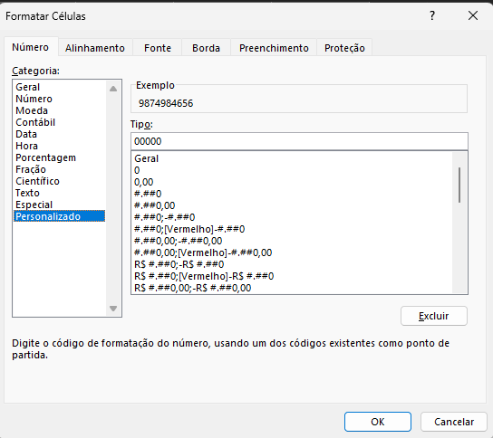

# Formatando Valores numéricos
- `crtl + shift + !`: Selecione os numeros e formata os valores colocando o separador **.** para separar milhar e **,** como separador decimal.
- `ctrl + 1`: Selecione os numeros e rode este comando para formatar os valores. Vá em *Personalizdo*

## Formatando


O campo `Tipo` segue a estrutura:
> positivo; negativo; zero; texto
Suponha que sua celula tenha o valor *42*:
```txt
> 00000 → 00042
> ##### → 42
```
Resumindo, `0` força aparecer algo, `#` só mostra se existir. Já o `,` é o separador de milhar e `.` separa decimais.
``` txt
numero 1234
> #,##0 → 1.234
```
Um exemplo com decimais
``` txt
numero: 1234.5
> #,##0.00 → 1.234,50
```

### Datas & Horas
``` txt
dd/mm/yyyy      → 21/03/2026
dd-mmm-yyyy     → 21-Mar-2026
mmmm yyyy       → Março 2026

hh:mm
hh:mm:ss
```

### Condições
``` txt
> [>1000] "Alto";[>500] "Médio";"Baixo"
```

### Setas
``` txt
> [Verde]▲ #,##0;[Vermelho]▼ #,##0
```

### Valores Grandes
``` txt
> #,##0,"K"      → milhares
> #,##0,,"M"     → milhões
```

### positivo; negativo; zero; texto
```txt
Caso 1 - Positivo
> #,##0

Caso 2 - Positivo & Negativo
> #,##0;[Vermelho]-#,##0

Caso 3 - Positivo & Negativo & Zero
> #,##0;[Vermelho]-#,##0;0
> #,##0;[Vermelho]-#,##0;  (isso esconde o zero ; está vazio)

Caso 4 - Positivo & Negativo & Zero & Texto
> #,##0;[Vermelho]-#,##0;0;"Texto aqui"
```
#### Exemplo
```txt
1. Exemplo
"Lucro " #,##0;[Vermelho]"Prejuízo ("#,##0")";"Neutro"
```
| Valor | Exibição |
|-------|----------|
| 1000 | Lucro 1.000 |
| -500 | Prejuízo (500) |
| 0 | Neutro |
```txt
2. Exemplo
[Verde]#,##0;[Vermelho](#,##0);"Zero";"Texto"
```

## Summary
- `0`: Obriga aparecer;
- `#`: Opcional, só mostra se existir;
- `,`: Organiza milhares
- `.`: Organiza Decimais