# Dataset
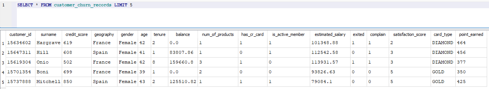

## Filters
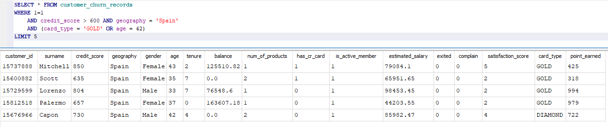

## IN
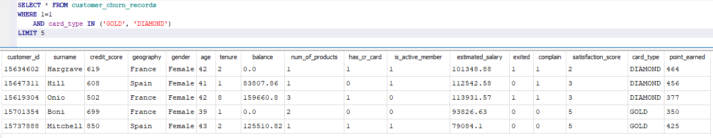

## NOT IN
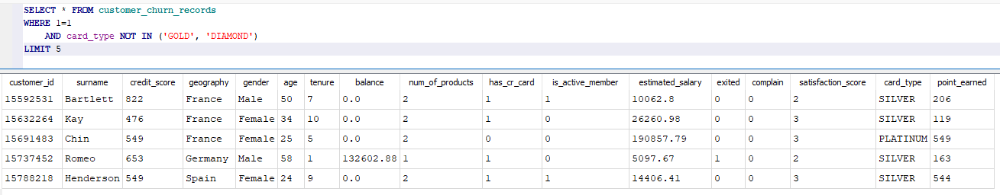

## BETWEEN
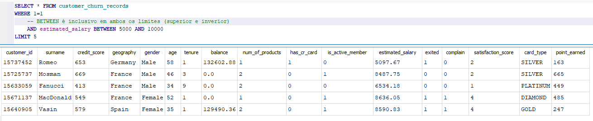

## NLARGEST & NSMALLEST
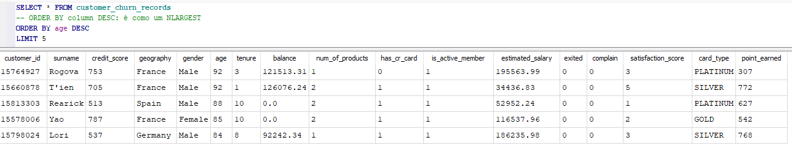

## NA's
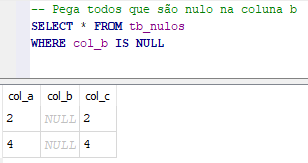
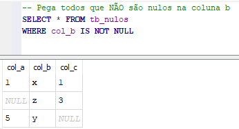

## Linhas Duplicadas
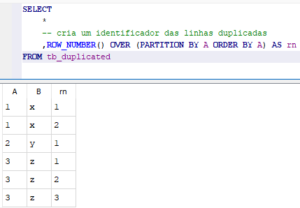
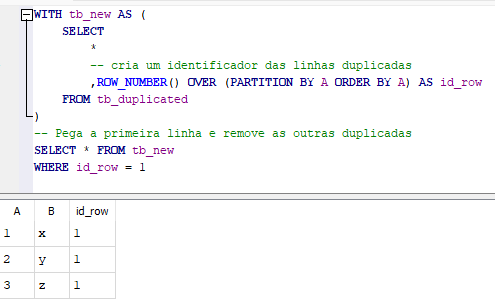
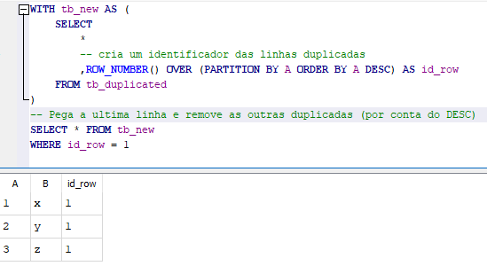

## DISTINCT
O `DISTINCT` remove linhas duplicadas do resultado de uma consulta, retornando apenas valores únicos.
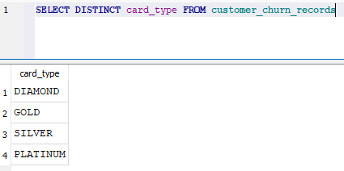

## CASE WHEN
O `CASE WHEN` faz uma clausula *if* *else* na sua coluna. Ele também pode fazer interações entre as colunas.
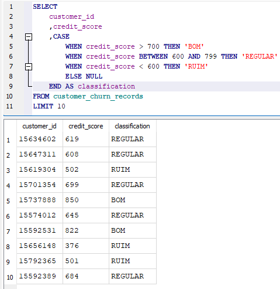