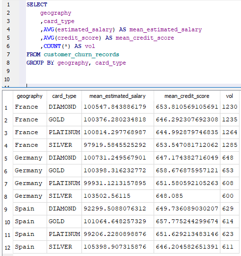
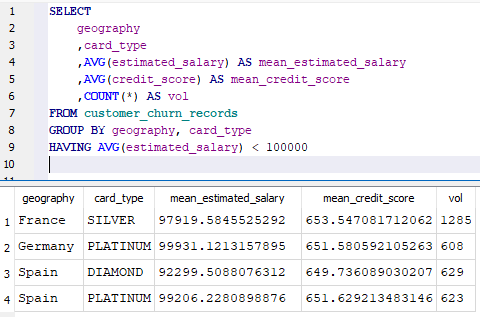
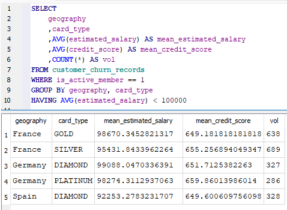

TODO: Ajuste remova as imagens deixe apenas o código SQL
# GROUP BY
A clausula `GROUP BY` faz a agregação de linhas iguais e resume elas. A maneira como ele funciona é a seguinte:
1. Agrupa as linhas por uma (ou varias) coluna(s) através dos seus valores;
2. Junta os semelhantes;
3. Aplica a função de agregação (ou as funções de agregação)

IMPORTANTE: O que está no `SELECT` precisa estar ou no agrupamento `GROUP BY` ou em alguma função de agregação.


## Funções de agregação
- `COUNT`: Conta linhas
```sql
SELECT COUNT(*) FROM tb_main  -- Conta tudo até nulos
SELECT COUNT(coluna_a) from tb_main  -- conta ignorando nulos na coluna passada
```
- `SUM`: Soma valores de uma coluna;
- `AVG`: Faz a média de uma coluna;
- `MIN / MAX`: Pega o minimo ou o máximo de uma coluna;
- `COUNT(DISTINCT coluna_a)`: Faz a contagem de valores únicos em uma coluna.

## HAVING
O `HAVING` filtra grupos de resultados **após** aplicar o `GROUP BY`. É um `WHERE` para grupos.


Utilizando `WHERE` para filtrar antes do agrupamento `GROUP BY`
