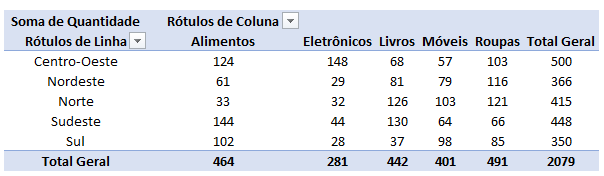
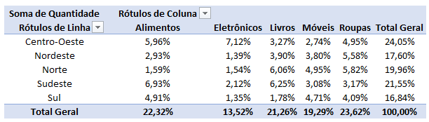
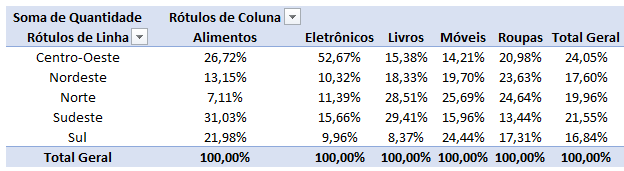
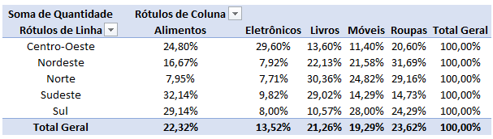

# Como atualizar a Fonte de Dados de uma Tabela Dinamica
- 1. Transforme em Tablea sua fonte de dados (Ctrl + Alt + t)
- 2. Mude os dados Copie e Cole (Cole com Valores para não perder a formatação)
- 3. Vá na aba da Tabela Dinâmica
    - 1. Clique em Análise de Tabela Dinamica
    - 2. Atualizar: Atualizar Tudo

# Mostrar valores
Sem calculo temos a quantidade (ou qualquer outra métrica)

## Percentual do Total Geral
Quanto cada casela representa do total

## Percentual da Coluna
O quanto representa da coluna 

## Percentual da Linha
O quanto representa da linha
