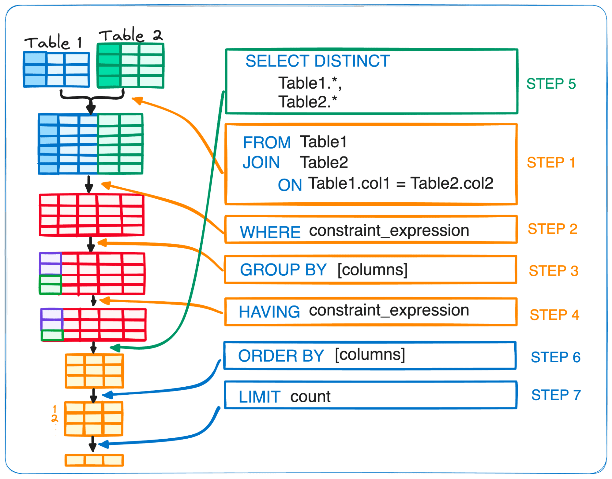

TODO: Ajuste remova as imagens deixe apenas o código SQL
# Dataset
Olhando o nosso conjunto de dados (*dataset*):
```SQL
SELECT * FROM customers LIMIT 10
```

## Filters
Filtrando nosso conjunto de dados:
```SQL
SELECT * FROM customers
WHERE 1=1
    AND credit_score > 600
    AND geography = 'Spain'
    AND (card_type = 'GOLD' OR age = 42)
LIMIT 10
```

## IN (NOT IN)
Faz o filtro de inclusão:
```SQL
-- Condição verdadeira
SELECT * FROM customers
WHERE 1=1
    AND card_type IN ('GOLD', 'DIAMOND')
LIMIT 10

-- Condição se Falsa
SELECT * FROM customers
WHERE 1=1
    AND card_type NOT IN ('GOLD', 'DIAMOND')
LIMIT 10
```

## BETWEEN
Escolhe um intervalo:
```SQL
SELECT * FROM customers
WHERE 1=1
    -- BETWEEN é INCLUSIVO em ambos os limites (superior e inferior)
    AND estimated_salary BETWEEN 5000 AND 10000
LIMIT 10
```

## NLARGEST & NSMALLEST
Ordena os valores `ASC` ou `DESC`.
- `ASC`: Do menor para o maior;
- `DESC`: Do maior para o menor.
```SQL
SELECT * FROM customers
-- ORDER BY age ASC -- Os 10 mais novos 
ORDER BY age DESC  -- Os 10 mais velhos
LIMIT 10
```

## NA's
```SQL
SELECT * FROM customers
WHERE age IS NULL

SELECT * FROM customers
WHERE age IS NOT NULL
```

## Linhas Duplicadas
```SQL
SELECT
    *
    -- Cria um identificador das linhas duplicadas
    ,ROW_NUMBER() OVER(PARTITION BY id_customer ORDER BY id_customer) AS rn
FROM customers

WITH customers_no_duplicates AS (
    SELECT
        *
        -- Cria um identificador das linhas duplicadas
        ,ROW_NUMBER() OVER(PARTITION BY id_customer ORDER BY id_customer) AS rn
    FROM customers
)
-- Pega a primeira linha e remove as outras duplicadas
SELECT * FROM customers_no_duplicates
WHERE rn = 1
```

## DISTINCT
O `DISTINCT` remove linhas duplicadas do resultado de uma consulta, retornando apenas valores únicos.
```SQL
SELECT DISTINCT card_type FROM customers
```

## CASE WHEN
O `CASE WHEN` faz uma clausula *if* *else* na sua coluna. Ele também pode fazer interações entre as colunas.
```SQL
SELECT
    id_customer
    ,credit_score
    ,CASE
        WHEN credit_score > 700 THEN 'GOOD'
        WHEN credit_score BETWEEN 600 AND 699 THEN 'REGULAR'
        WHEN credit score < 600 THEN 'BAD'
        ELSE NULL
    END AS classification
FROM customers
LIMIT 10
```

## COALESCE
Retorna o primeiro valor não nulo de uma lista de argumentos, é útil para lidar com valores `NULL`.
```SQL
COALESCE(valor1, valor2, valor3, ..., valorN)
```

## EXISTS (NOT EXISTS)
É como um `FILTRO` de registros que estão (ou não) em outra tabela.
```SQL
-- O que é IN
SELECT
    *
FROM customers AS c
WHERE EXISTS (
    SELECT 1 FROM orders AS o
    WHERE c.id_customer = o.id_customer
)
-- ISso é equivalente:
SELECT
    *
FROM customers
WHERE  id_customer IN (
    SELECT id_customer FROM orders AS o
)

-- O que é NOT IN
SELECT
    *
FROM customers AS c
WHERE NOT EXISTS (
    SELECT 1 FROM orders AS o
    WHERE c.id_customer = o.id_customer
)
```

## LIKE & ILIKE
Buscam padrões dentro de `strings`, `%` é o caracter curinga e `_` obriga a existencia de caracter.
```SQL
-- Nomes que começam com "Ana"
SELECT * FROM clientes WHERE nome LIKE 'Ana%'

-- Nomes que terminam com "Silva"
SELECT * FROM clientes WHERE nome LIKE '%Silva'

-- Nomes que contêm "ar" em qualquer posição
SELECT * FROM clientes WHERE nome LIKE '%ar%'

-- Nomes com exatamente 5 letras
SELECT * FROM clientes WHERE nome LIKE '_____'

-- Nomes onde a segunda letra é "a"
SELECT * FROM clientes WHERE nome LIKE '_a%'

-- Encontra "ana", "Ana", "ANA", "AnA" etc.
SELECT * FROM clientes WHERE nome ILIKE 'ana%'

-- Todos que NÃO começam com "Test"
SELECT * FROM clientes WHERE nome NOT LIKE 'Test%'
```

## Funções com TEXTO
```SQL
-- CONCATENAÇÃO
SELECT CONCAT(nome, ' ', sobrenome) AS nome_completo FROM clientes
-- ou
SELECT nome || ' ' || sobrenome AS nome_completo FROM clientes

-- TAMANHO DA STRING
SELECT nome, LENGTH(nome) AS qtd_caracteres FROM clientes

-- MAIÚSCULAS & MINÚSCULAS
SELECT UPPER(nome), LOWER(nome) FROM clientes

-- REMOVE ESPAÇOS EM BRANCO
SELECT TRIM(nome) FROM clientes
SELECT TRIM(LEADING ' ' FROM nome) FROM clientes
SELECT TRIM(TRAILING ' ' FROM nome) FROM clientes

-- SLICE
SELECT SUBSTR(nome, 1, 3) FROM clientes

-- SUBSTITUIR PEDAÇOS
SELECT REPLACE(email, '@gmail.com', '@empresa.com') FROM clientes

-- REGEX (ALGUMAS ENGINE SQL SUPORTAM)
SELECT * FROM clientes WHERE REGEXP_LIKE(nome, '^Ana');
SELECT REGEXP_EXTRACT(email, '@(.+)$', 1) AS dominio FROM clientes;
SELECT REGEXP_REPLACE(telefone, '[^0-9]', '') AS telefone_limpo FROM clientes;
```

## Ordem de Precedencia de uma Query
1. FROM
2. JOIN
3. WHERE
4. GROUP BY
5. HAVING
6. SELECT
7. DISTINCT
8. ORDER BY
9. LIMIT

```txt
FROM → WHERE → GROUP BY → HAVING → SELECT → ORDER BY → LIMIT
```
